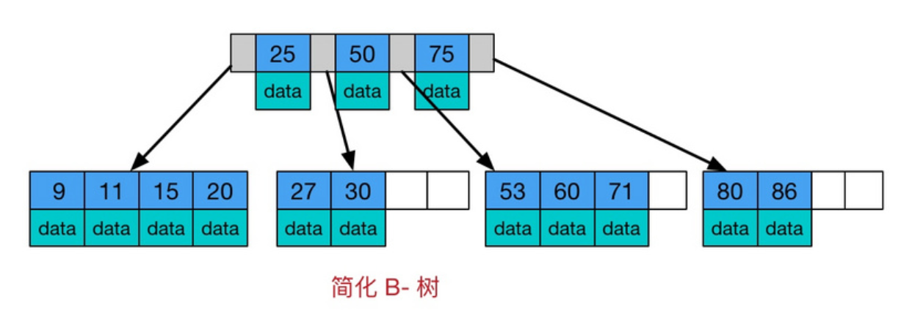

## 一、B树、B+树的定义
### 一棵 m 阶B树的定义
* 每个节点最多只有m个子节点
* 除了根节点外，每个非叶子节点至少有 ceil(m/2) 个子节点（根节点除外）
* 非叶子节点的根节点至少有个两个子节点
* 有 k 棵子树的非叶子节点有 k-1 个键，键按照递增顺序排列
* 叶节点都在同一层

### m 阶B+树和B树的区别是什么
* B+树的数据都保存在叶子节点，并且用指针连结到一起，B数的数据都保存在每一个节点
* B+树每个节点子树数目和关键字数目相同，而B树是子树数目-1

### 所以为什么 MySQL 的索引采用 B+树？
1. B+树更加矮胖，磁盘I/O效率更高
这里我理解，如果一个节点大小在一个数据页面范围内，因为每个节点B+可以存放的关键码数比B树多一个，B+树会更加矮胖，I/O次树更少
如果一个节点大小不止一个数据页，那么这时候因为B+树内节点不存储数据因而更小，可以用更少的数据页实现加载
2. B+树的数据都存储在叶子节点，适合区间扫描
3. B+树查询效率更加稳定

[参考资料：B树和B+树的区别](https://blog.csdn.net/login_sonata/article/details/75268075?spm=1001.2101.3001.6661.1&utm_medium=distribute.pc_relevant_t0.none-task-blog-2%7Edefault%7ECTRLIST%7ERate-1-75268075-blog-114588507.pc_relevant_3mothn_strategy_recovery&depth_1-utm_source=distribute.pc_relevant_t0.none-task-blog-2%7Edefault%7ECTRLIST%7ERate-1-75268075-blog-114588507.pc_relevant_3mothn_strategy_recovery&utm_relevant_index=1)

## 一、binlog 和 redo 的区别
1. binlog 属于数据库 Server 层的日志，redo log 是 InnoDB 引擎特有的
2. binlog 是逻辑日志，记录的是每次操作的 SQL，redo log 是物理日志，记录的是数据页的更新
3. binlog 是追加写日志， redo log是循环写日志，空间固定会用完

