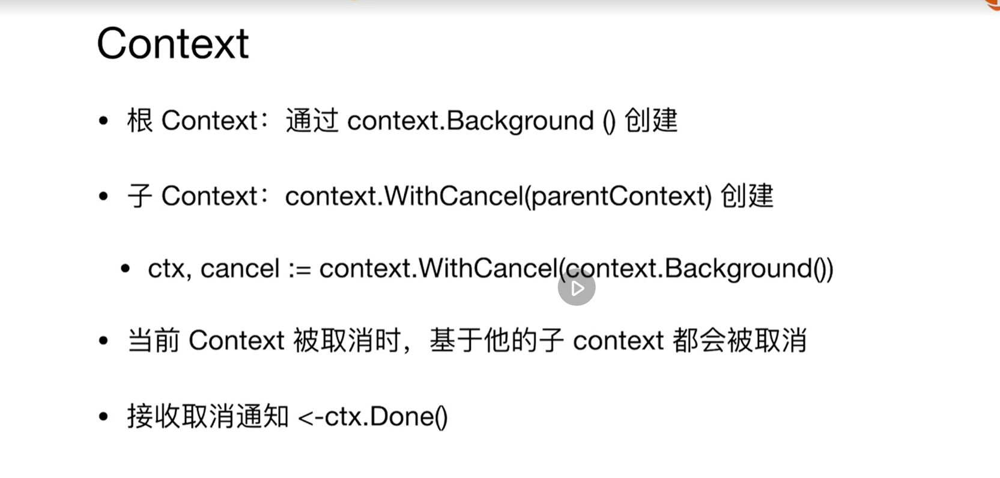

## 一、任务的取消: Close广播关闭

```go
func isCancelled(cancelChan chan struct{}) bool {
	select {
	case <-cancelChan:
		return true
	default:
		return false
	}
}

func cancel_1(cancelChan chan struct{}) {
	cancelChan <- struct{}{}
}

func cancel_2(cancelChan chan struct{}) {
	close(cancelChan)
}

func TestCancel(t *testing.T) {
	cancelChan := make(chan struct{}, 0)

	for i := 0; i < 5; i++ {
		go func(i int, cancelCh chan struct{}) {
			for {
				if isCancelled(cancelCh) {
					break
				}
				time.Sleep(time.Millisecond * 5)
			}
			fmt.Println(i, "Cancelled")
		}(i, cancelChan)
	}
	cancel_1(cancelChan) // 只有一个 Goroutine 被取消了
	//cancel_2(cancelChan) // 所有 Goroutine 都关闭了，广播机制：关闭后管道会立刻被读
	time.Sleep(time.Second * 1)
}
```

## 二、任务的取消: context 广播关闭

```go
func isCancelled(ctx context.Context) bool {
	select {
	case <-ctx.Done():
		return true
	default:
		return false
	}
}

func TestCancel(t *testing.T) {
	ctx, cancel := context.WithCancel(context.Background())

	for i := 0; i < 5; i++ {
		go func(i int, ctx context.Context) {
			for {
				if isCancelled(ctx) {
					break
				}
				time.Sleep(time.Millisecond * 5)
			}
			fmt.Println(i, "Cancelled")
		}(i, ctx)
	}

	cancel()
	time.Sleep(time.Second * 1)
}
```