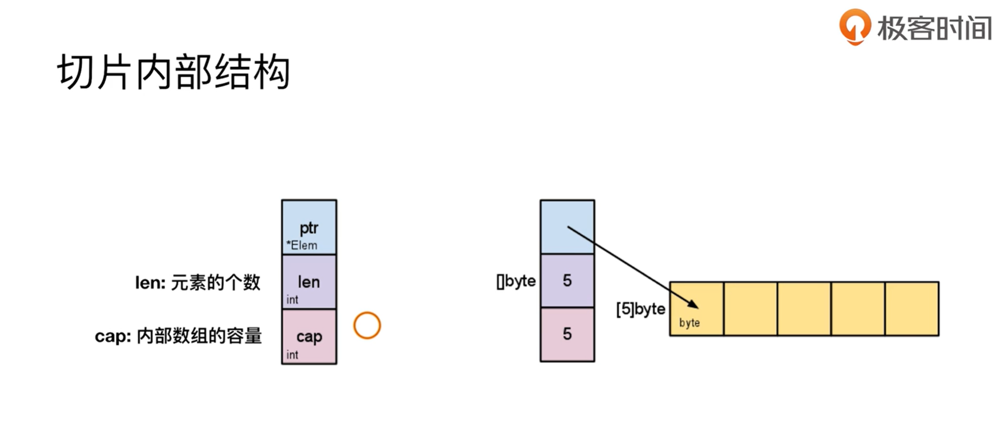
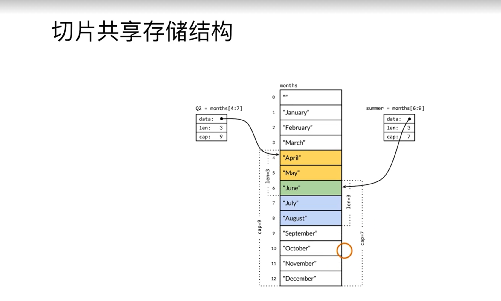
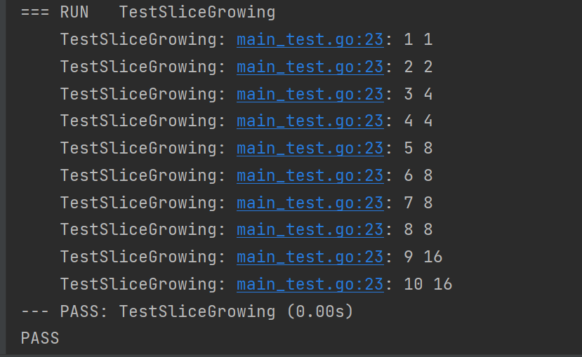

## 一、切片
1. 切片内部结构(切片共享存储结构)


```go
func TestSliceShareMemory(t *testing.T) {
	year := []string{"Jan", "Feb", "Mar", "Apr", "May", "Jun", "Jul", "Aug",
		"Sep", "Oct", "Nov", "Dec"}

	Q2 := year[3:6]
	t.Log(Q2, len(Q2), cap(Q2)) // [Apr May Jun] 3 9

	summer := year[5:8]
	t.Log(summer, len(summer), cap(summer)) // [Jun Jul Aug] 3 7

	summer[0] = "Unknown"
	t.Log(Q2) // [Apr May Unknow] 受到了影响
	t.Log(year)
}
```
2. 切片扩容: 当前 cap 的两倍
```go
func TestSliceGrowing(t *testing.T) {
	s := []int{}
	for i := 0; i < 10; i++ {
		s = append(s, i)
		t.Log(len(s), cap(s))
	}
}
```


## 二、数组 VS. 切片
1. 容量是否可伸缩
2. 是否可比较
维度、长度相等的数组是可以比较的
切片是不可以比较的

