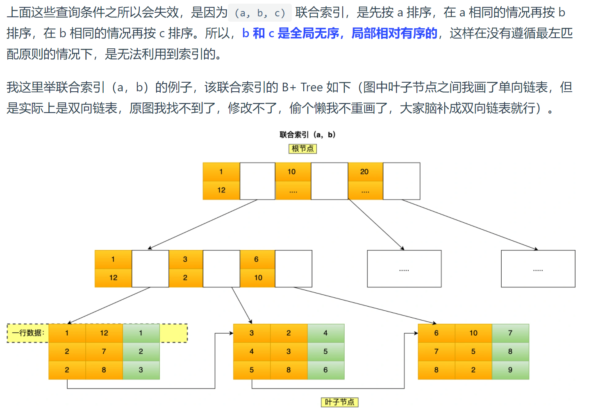

## 一、Go自定义比较算法
```go
package main

import (
	"fmt"
	"sort"
)

type MyDefSlice struct {
	Id   int
	Name string
}

type MySlice []MyDefSlice

func (p MySlice) Less(i, j int) bool {
	return p[i].Id > p[j].Id
}

func (p MySlice) Len() int {
	return len(p)
}

func (p MySlice) Swap(i, j int) {
	p[i], p[j] = p[j], p[i]
}

func main() {
	mySlice := make(MySlice, 0)
	for i := 0; i < 10; i++ {
		mySlice = append(mySlice, MyDefSlice{
			Id:   i,
			Name: fmt.Sprintf("slice_%d", i),
		})
	}
	sort.Sort(mySlice)
	fmt.Printf("mySlice:%v\n", mySlice)
}

```

## 二、联合索引
1. 最左匹配原则：第一个字段是全局有序，其他的是全局无序的

2. 存在部分字段用到联合索引的 B+Tree，部分字段没有用到联合索引的 B+Tree 的情况：这种特殊情况就发生在范围查询

## 三、索引失效
1. 当我们使用左或者左右模糊匹配的时候，也就是 like %xx 或者 like %xx%这两种方式都会造成索引失效；
2. 当我们在查询条件中对索引列做了计算、函数、类型转换操作，这些情况下都会造成索引失效；
3. 最左匹配不符合
4. 在 WHERE 子句中，如果在 OR 前的条件列是索引列，而在 OR 后的条件列不是索引列，那么索引会失效

## 四、数据库的ACID
1. 持久性用到了 redo log （binlog好像是用来备份的？）
2. 原子性通过 undo log 来保证的
3. 数据的隔离性是用到了MVCC+锁（可重复读用到了间隙所，串行化用到了读写锁）
4. 一致性通过 持久性 + 原子性 + 隔离性保证的

## 五、缓存雪崩、缓存击穿、缓存穿透
1. 缓存雪崩：大量缓存数据在同一时间失效或者 Redis 故障宕机 \
情景1：大量数据同时过期 \
. 均匀设置过期时间 \
. 互斥锁（比如Go 的singleFlight）\
情景2：Redis宕机 \
. 服务熔断 \
. 请求限流
2. 缓存击穿
. 互斥锁（比如Go 的singleFight） \
. 不设置过期时间，由后台更新缓存 \
3. 缓存穿透 \
. 非法请求限制 \
. 缓存空值或者默认值（常用）
. 布隆过滤器快速判断数据是否存在

## 六、缓存不一致性
1. 讨论缓存不一致性最终的着眼点是：所有并发操作结束之后，Redis和Mysql里面的数据是否保持一致，其他的中间过程短暂不一致其实是没办法避免的，这个也不是主要着眼点：\
比如先更新数据库，再更新缓存，如果数据库已经更新好了，还没更新Redis，这时候读请求从Redis里面把数据读走了，算不算不一致？ \
答案是：不算。因为对用户感知来说，只有Redis更新成功之后才会返回给他成功的结果。此后的查询都是一致的，并没有显示修改了但是查询旧值的问题。
2. 所以对这类题目的系统性思考是这样子的：\
21 一般不采用双更新的方法，因为更新操作相对删除更复杂，而且数据一更新就update缓存，容易把过多冷数据放到缓存里面 \
22 最常用的就是方法就是先更新db，再删除缓存（配合设置过期时间）能满足大部分需求，这种情况仍然会面临的问题就是小概率的不一致和删除缓存失败 \
   再严谨一点可以用先更新db，再延迟删除缓存（配合设置过期时间）, 这个可能会短时间存在查询旧数据情况
   再再严谨一点可以用延迟双删除，减少读到旧数据的概率
   不过以上方法还是无法应对，如redis删除失败，延迟时间不合理导致的短暂不一致：（设置过期时间+将第二个操作（删除redis）加入MQ）
3. 没有被办法保证完全的时刻一致性，除非完全串行，放弃读写并发性能
4. 参考资料：[https://www.jianshu.com/p/0387b44e7f51]

## 七、进程间的通信方式
1. 管道，本质内核空间一段缓冲区. \
   类型：匿名管道：cat test.txt | grep "xxx" 用于父子关系进程; 命名管道:提前设置一个类型为管道的设备文件. \
   缺点：单向通信，交换数据量小.
2. 消息队列：本质是保存在内核中的消息链表. \
   优点: 克服了管道通信的数据是无格式的字节流的问题.
   缺点: 通信不及时，不适合比较大数据传输.
3. 共享内存. \
   优点：解决消息队列通信中用户态与内核态之间数据拷贝过程带来的开销.
4. 信号量, 进程之间的互斥与同步. PV操作.
5. 信号, Linux 操作系统提供了几十种不同的信号，分别代表不同的意义.
6. Socket.

## 八、进程 && 线程 && 协程
1. 进程是分配资源的基本单位，比如内存空间、打开的文件资源.
2. 线程是操作系统调度的基本单位，只独享必不可少的资源，如寄存器和栈，见很少并发开销.
3. 线程的创建，销毁，切换都会比较快，因为不涉及地址空间（虚拟内存共享）、文件信息管理等.
4. 协程一般称为用户态的轻量级线程，由用户在语言层直接实现，协程切换不需要操作系统内核的支持，只需要修改程序计数器和栈空间等轻量级操作，相对来说会更加高效一些.
5. 协程切换的开销，请具体说明 [https://www.zhihu.com/question/504791946]

